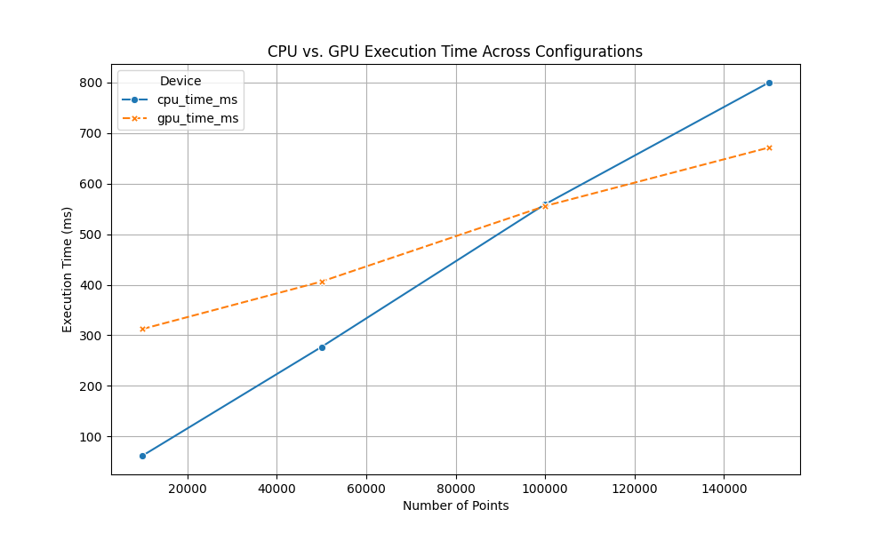
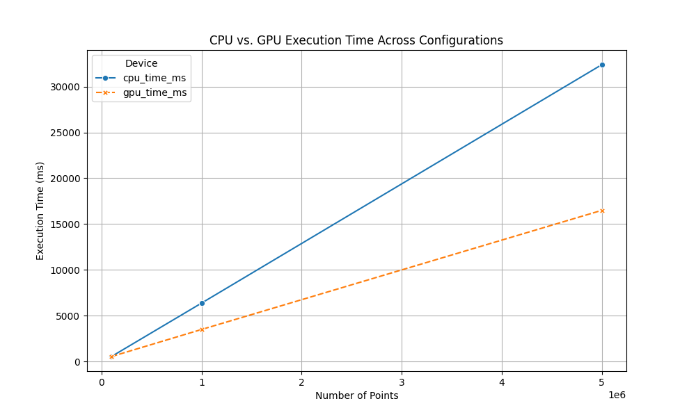
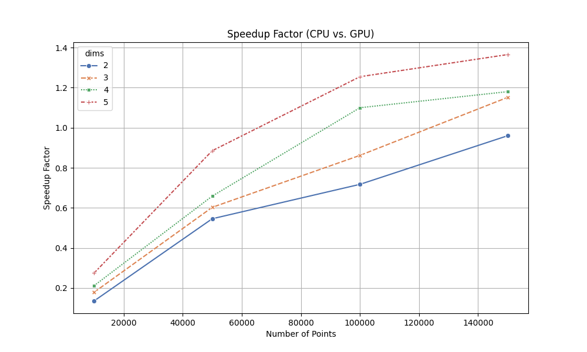
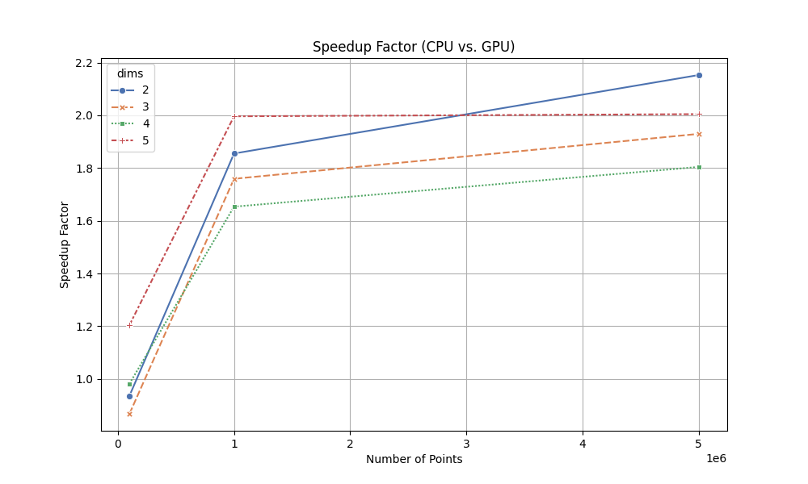
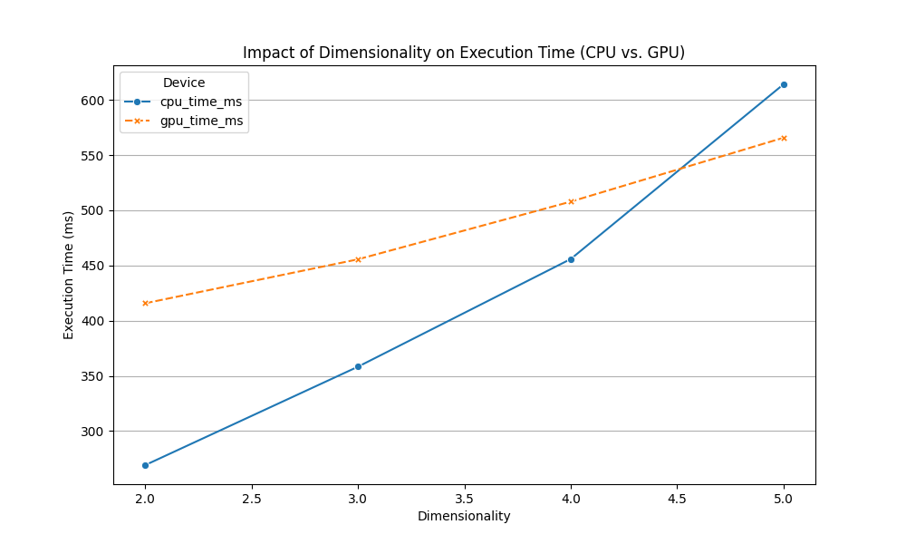
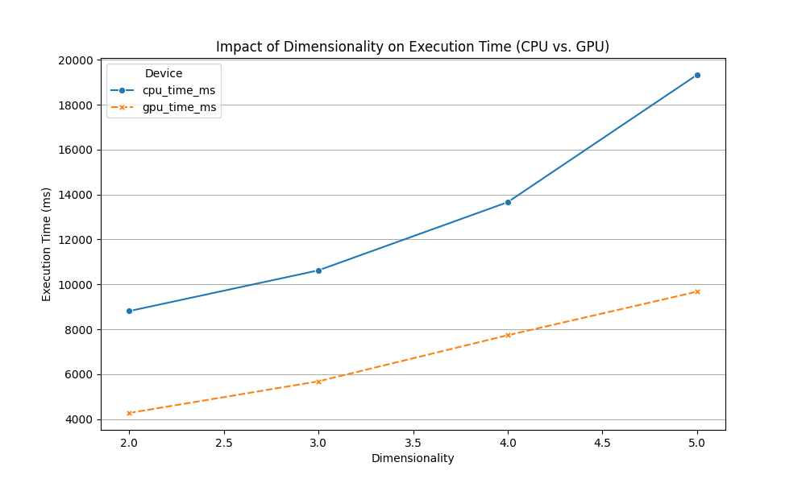
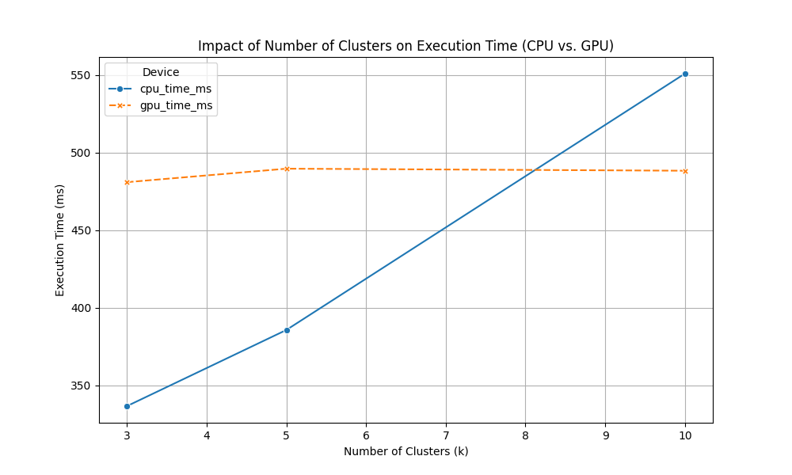
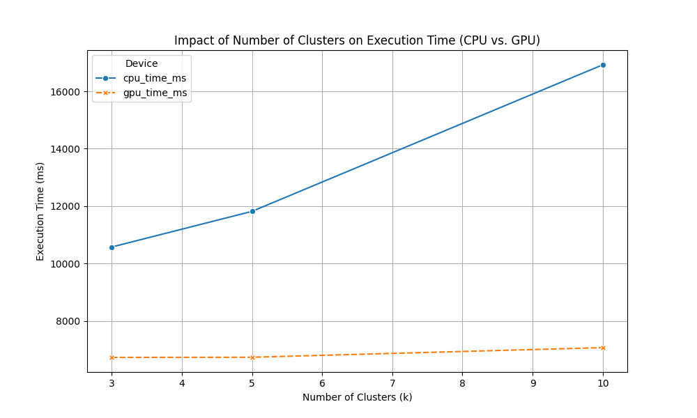
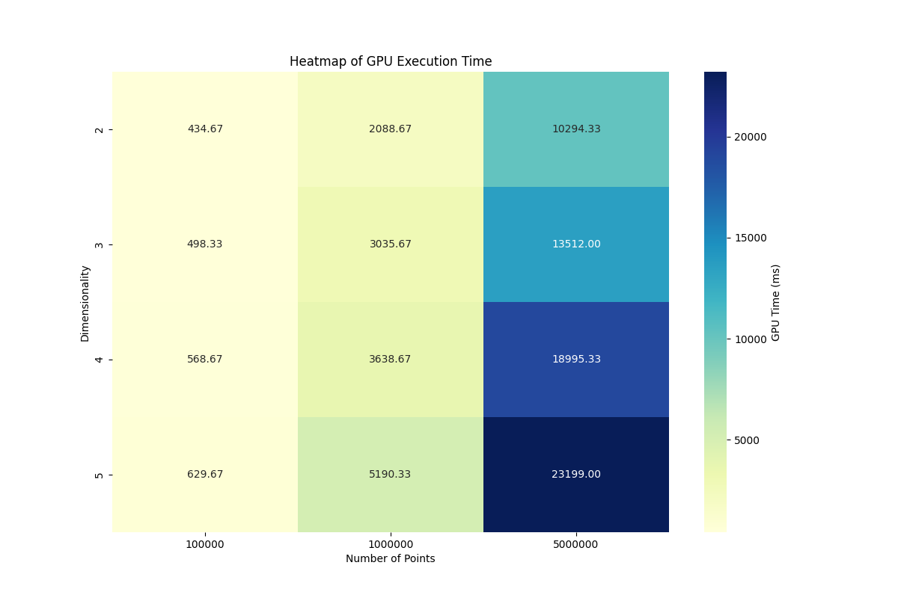

## K-Means Clustering with GPU and CPU Implementations

This project implements the k-means clustering algorithm using both CPU and GPU. The goal is to explore the performance differences between sequential (CPU) and parallel (GPU) approaches. The implementation supports configurable dimensions, cluster counts, and iterations, with the GPU implementation leveraging CUDA for parallel computation.

---

### **Table of Contents**
1. [Theory](#theory)
2. [Implementation Details](#implementation-details)
3. [Project Structure](#project-structure)
4. [Usage](#usage)
5. [References](#references)

---

### **Theory**

#### **What is K-Means Clustering?**
K-means clustering is a machine learning algorithm used for partitioning a dataset into `k` clusters. Each cluster is represented by a centroid, and each data point is assigned to the cluster whose centroid is nearest. The algorithm iteratively refines the centroids until convergence or until the maximum number of iterations is reached.

#### **Steps of the Algorithm**
1. **Initialize Centroids**:
   - Randomly select `k` points as the initial centroids.
2. **Assignment Step**:
   - Assign each data point to the nearest centroid based on the Euclidean distance.
3. **Update Step**:
   - Recompute the centroids as the mean of the points in each cluster.
4. **Repeat**:
   - Repeat the assignment and update steps until centroids converge or a set number of iterations is reached.

#### **Parallelization on GPU**
The embarrassingly parallel nature of k-means clustering makes it well-suited for GPU acceleration. Specifically:
- **Assignment Step**: Each thread handles the computation of a single point’s distance to all centroids.
- **Update Step**: Shared memory and atomic operations are used to aggregate points for centroid recalculation efficiently.

For a deeper understanding:
- [Wikipedia: K-Means Clustering](https://en.wikipedia.org/wiki/K-means_clustering)
- [Parallel K-Means Algorithm](http://www.eecs.northwestern.edu/~wkliao/Kmeans/index.html)

---

### **Implementation Details**

#### **CPU Implementation**
The CPU implementation follows a straightforward, sequential approach:
- Assigns each point to its nearest centroid.
- Computes new centroids iteratively.
- Uses standard C++ data structures like `std::vector` for simplicity.

**Reference for CPU Implementation**:
- Algorithm steps inspired by standard k-means clustering explanations from [Nvidia K-Means](https://www.nvidia.com/en-us/glossary/k-means/) and [Stanford CS231n](https://github.com/cs231n/cs231n.github.io/blob/master/classification.md).

#### **GPU Implementation**
The GPU implementation is designed for efficiency:
- **Assignment Kernel**:
  Each thread computes the distance of one point to all centroids and determines the closest cluster.
- **Update Kernel**:
  Shared memory and atomic operations are used to aggregate cluster sums for centroid updates.

**Key Components Inspired by References**:
- Shared memory usage and kernel structure: [CUDA C Programming Guide](https://docs.nvidia.com/cuda/cuda-c-programming-guide/index.html)
- Parallel k-means: [Northwestern Parallel K-Means](http://www.eecs.northwestern.edu/~wkliao/Kmeans/index.html) and [Nvidia K-Means](https://www.nvidia.com/en-us/glossary/k-means/)

**Specific Inspirations**:
- **Centroid Initialization**: Random centroid selection from the dataset is standard practice.
- **Shared Memory Aggregation**: Adapted from NVIDIA's guide on atomic operations.
- **Memory Coalescing**: Informed by NVIDIA’s CUDA programming best practices.

---

### **Project Structure**
```
project/
├── bin/                  # Compiled executables
├── data/                 # Input and generated datasets
├── include/              # Header files
├── src/                  # Source files
│   ├── generate_input.cu # Generates random data points
│   ├── kmeans_gpu.cu     # GPU-based k-means implementation
│   ├── kmeans_cpu.cpp    # CPU-based k-means implementation
├── output/               # Output files for cluster assignments
├── Makefile              # Build instructions
├── README.md             # Project documentation
└── run.sh                # Script to run CPU and GPU implementations
```

---

### **Results**

#### **1. Overview**

This section summarizes the performance benchmarks for the k-means clustering implementation, comparing **CPU** and **GPU** across different configurations. Two benchmarks were run:
1. **Small Dataset Run**:
   - Number of points (`N`): 10k, 50k, 100k, 150k.
   - Dimensions (`dims`): 2, 3, 4, 5.
   - Clusters (`k`): 3, 5, 10.
2. **Big Dataset Run**:
   - Number of points (`N`): 100k, 1M, 5M.
   - Dimensions (`dims`): 2, 3, 4, 5.
   - Clusters (`k`): 3, 5, 10.

Key metrics:
- **Execution Time**: Comparison of time taken by CPU and GPU for each configuration.
- **Speedup Factor**: Ratio of CPU to GPU execution times, indicating performance improvement.

#### **2. Observations**

- **Small Datasets**:
  - GPU is slower than CPU for datasets with fewer than 100k points due to overhead from memory transfers and kernel launches.
  - As the dataset approaches 100k points, GPU performance becomes comparable to CPU.
  - This threshold changes depending on the dimensionality and number of clusters.
- **Large Datasets**:
  - GPU becomes significantly faster than CPU, with speedups ranging from **1.6x** to **2x** (1M points), depending on the configuration.
  - The performance gap widens with increasing `N`, higher dimensionality (`dims`), and more clusters (`k`).

---

#### **3. Visualizations**

##### **3.1 CPU vs. GPU Execution Time Across Configurations**
**Small Dataset Run**:


**Big Dataset Run**:


**Insight**:
- For small datasets, CPU execution time increases linearly, while GPU has higher overhead for smaller `N`.
- For large datasets, GPU consistently outperforms CPU, with the performance gap increasing with `N`.

---

##### **3.2 Speedup Factor**
**Small Dataset Run**:


**Big Dataset Run**:


**Insight**:
- Speedup factor remains below `1` for small datasets (<100k points), indicating CPU is faster.
- For large datasets, GPU achieves a speedup of up to **2.1x** over CPU, depending on the configuration.

---

##### **3.3 Impact of Dimensionality**
**Small Dataset Run**:


**Big Dataset Run**:


**Insight**:
- Execution time increases for both CPU and GPU as dimensionality grows.
- GPU scales more efficiently with higher dimensions, maintaining lower execution times compared to CPU for large datasets.

---

##### **3.4 Impact of Number of Clusters**
**Small Dataset Run**:


**Big Dataset Run**:


**Insight**:
- Increasing `k` adds computational complexity for both CPU and GPU.
- GPU handles the increasing cluster count more efficiently, especially for larger datasets, due to parallel processing. In fact, GPU performance stays relatively stable across different cluster counts.

---

##### **3.5 Combined Performance Heatmap (Big Dataset Run)**


**Insight**:
- The heatmap highlights GPU execution time for varying combinations of `N` and `dims`.
- GPU execution time increases with `N` and `dims`, but remains significantly lower than CPU across all configurations when `N` is large.

---

#### **4. Analysis of Transition Point**

From the benchmarks:
- For datasets with **fewer than 100k points**, the CPU implementation is faster due to:
  - Lower kernel launch and memory transfer overheads.
  - Reduced benefits of GPU parallelism for smaller workloads.
- For datasets with **100k points or more**, the GPU becomes faster due to:
  - High thread parallelism effectively processing the larger workload.
  - Superior memory coalescing for high-dimensional data.

For **dim=3**, the **transition point** is clearly observed at **100k points**, where the GPU matches or surpasses CPU performance. This threshold can vary based on the dataset’s dimensionality and cluster count.

---

#### **5. Conclusion**

- **Small Datasets**:
  - Use the CPU implementation for datasets with fewer than 100k points.
  - The GPU implementation is not efficient for small workloads due to overhead.

- **Large Datasets**:
  - For datasets with 100k points or more, the GPU implementation is significantly faster and scales better with increased complexity.
  - Higher dimensions (`dims > 3`) and larger clusters (`k > 5`) further amplify the GPU’s advantage.

This analysis provides clear guidance on when to choose the CPU or GPU implementation based on dataset size and configuration.

---

### **Usage**

#### **Building the Project**
Ensure you have `nvcc` and `g++` installed. Run the following:
```bash
make all
```

#### **Generating Input Data**
Use the `generate_input` executable to create a dataset:
```bash
./bin/generate_data <output_file> <N> <dims>
```
- `<output_file>`: Path to save the generated data.
- `<N>`: Number of points.
- `<dims>`: Number of dimensions.

Example:
```bash
./bin/generate_data data/input.txt 10000 3
```

#### **Running the CPU Implementation**
```bash
./bin/kmeans_cpu <input_file> <output_file> <k> <max_iters>
```
- `<input_file>`: Path to the input dataset.
- `<output_file>`: Path to save the clustering results.
- `<k>`: Number of clusters.
- `<max_iters>`: Maximum iterations.

Example:
```bash
./bin/kmeans_cpu data/input.txt output/results_cpu.txt 3 100
```

#### **Running the GPU Implementation**
```bash
./bin/kmeans_gpu <input_file> <output_file> <k> <max_iters>
```
- Arguments are the same as for the CPU implementation.

Example:
```bash
./bin/kmeans_gpu data/input.txt output/results_gpu.txt 3 100
```

#### **Comparing CPU and GPU Performance**
To run the entire workflow with time measurements:
```bash
./run.sh
```

---

### **References**

#### **Algorithm Theory**
1. [K-Means Clustering - Wikipedia](https://en.wikipedia.org/wiki/K-means_clustering)
2. [CS231n: Classification](https://github.com/cs231n/cs231n.github.io/blob/master/classification.md)

#### **GPU Implementation**
1. [NVIDIA CUDA Programming Guide](https://docs.nvidia.com/cuda/cuda-c-programming-guide/index.html)
2. [Parallel K-Means Implementation](http://www.eecs.northwestern.edu/~wkliao/Kmeans/index.html)
3. [Nvidia K-Means Clustering Algorithm](https://www.nvidia.com/en-us/glossary/k-means/)